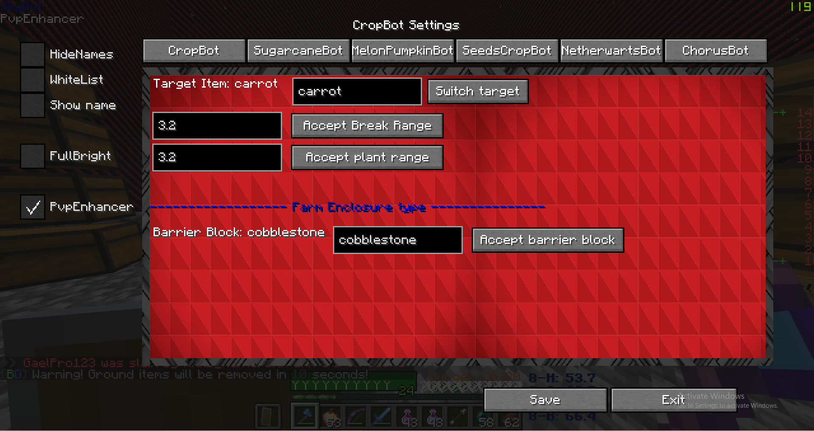

# Skybot

Minecraft 1.15.2 mod compatible with the Forge API.

This mod is meant to automate ingame farming: Potatoes, carrots, sugarcane, beetroot, pumpkins... in Skyblock gamemodes.

## Gif test

### Farming carrots gifs

### Pathfinding gifs

### Ingame options

### Config stuff

## How to install it

How to build and run it: From a console or terminal, go into the folder with the gradlew file in it. Then use "gradlew build" (or "./gradlew build") to build the mod. After that, go into build/libs. The build command from before will have generated a .jar file (by default called skybot-x.xx.x.jar).

To use the mod, install Forge 1.15.2 (the easiest way to do that is via TLauncher (https://tlauncher.org/en/). Open the .minecraft folder where Minecraft is installed, then move the jar file from before into .minecraft/mods and run the game.
